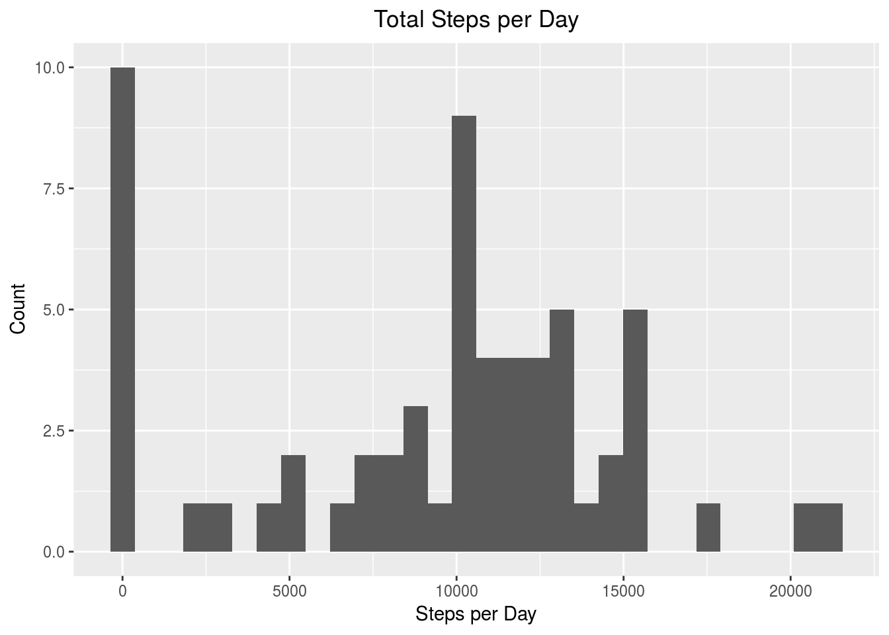
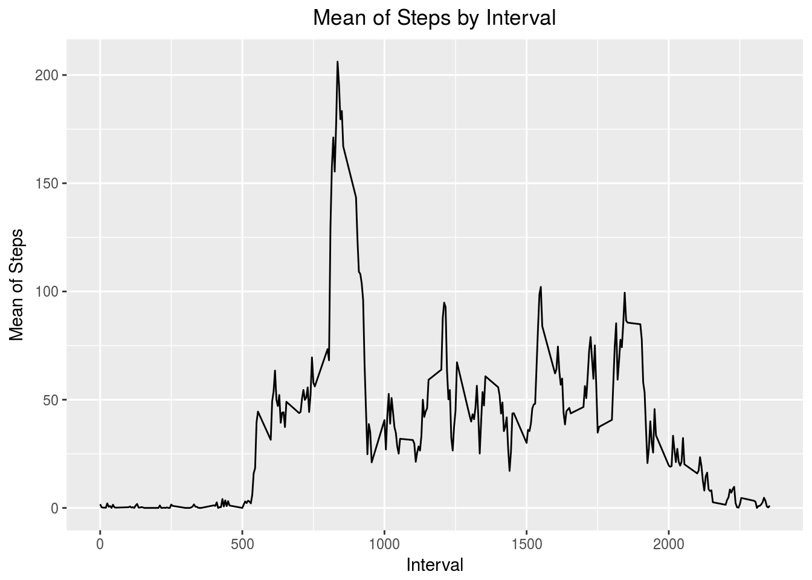
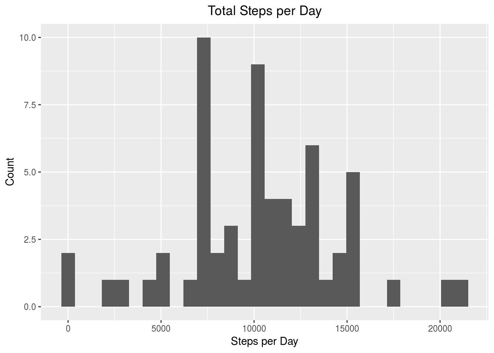
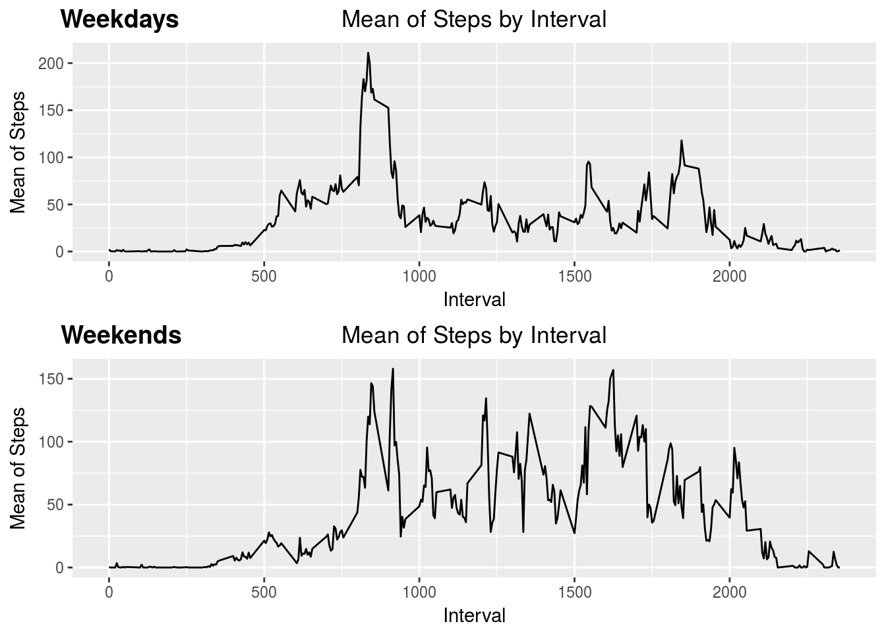

This document solve assignment number one of the course of **Johns Hopkins University** *Statistical Programing* course.

## Loading packages

We will start loading the packages needed to perform the activities.


```r
library(tidyr)
library(dplyr)
library(lubridate)
library(ggplot2)
library(xtable)
library(chron)
library(ggpubr)
```

Now, we are going to set a global configuration to center all plots inside document.


```r
theme_update(plot.title = element_text(hjust = 0.5))
```

## Loading and preprocessing the data

1. Load the data

The dataset is loaded directly from the zip that is in the directory. We are going to use de **tbl** formar just because the use of **dplyr** and **tidyr** packages are going to be useful in this assignment. Additionally, the column **date** is converted to *date/time* type.


```r
dataset = read.csv(unzip("activity.zip", "activity.csv"), sep = ",", header = TRUE, na.strings = "NA")
dataset = tbl_df(dataset)
```

We are going to arrange rows by date and interval. Also, we are going to transform the date column type to date/time type.


```r
dataset = arrange(dataset, date, interval)
dataset$date = parse_date_time(dataset$date, orders = c("ymd"))
```

## What is mean total number of steps taken per day?

To solve the qestion above we are going to plot an histogram indicating the density of the number of total steps taken per day.

1. Make a histogram of the total number of steps taken each day.


```r
temporal_dataset = dataset %>%
                      group_by(date) %>%
                        summarise(total_steps_per_day = sum(steps, na.rm = TRUE))

plot = ggplot(data = temporal_dataset, aes(total_steps_per_day))
plot = plot + geom_histogram()
plot = plot + labs(title = "Total Steps per Day",
       x = "Steps per Day",
       y = "Count")
plot
```



On this plot we can see how the most frequent value is 0 steps per day, later around 10000 steps are taken per day by this person. Now, we are going to calculate the mean and median of steps per day.

2. Calculate and report the **mean** and **median** total number of steps taken per day.


```r
xtbl = xtable(dataset %>% group_by(date) %>% summarise(mean_steps_per_day = mean(steps, na.rm = TRUE),
                                         median_steps_per_day = median(steps, na.rm = TRUE)))
xtbl$date = as.character(xtbl$date)
print(xtbl, type = "html", NA.string = "NA")
```

<!-- html table generated in R 3.4.3 by xtable 1.8-2 package -->
<!-- Sun Feb 11 14:30:51 2018 -->
<table border=1>
<tr> <th>  </th> <th> date </th> <th> mean_steps_per_day </th> <th> median_steps_per_day </th>  </tr>
  <tr> <td align="right"> 1 </td> <td align="right"> 2012-10-01 </td> <td align="right"> NA </td> <td align="right"> NA </td> </tr>
  <tr> <td align="right"> 2 </td> <td align="right"> 2012-10-02 </td> <td align="right"> 0.44 </td> <td align="right"> 0.00 </td> </tr>
  <tr> <td align="right"> 3 </td> <td align="right"> 2012-10-03 </td> <td align="right"> 39.42 </td> <td align="right"> 0.00 </td> </tr>
  <tr> <td align="right"> 4 </td> <td align="right"> 2012-10-04 </td> <td align="right"> 42.07 </td> <td align="right"> 0.00 </td> </tr>
  <tr> <td align="right"> 5 </td> <td align="right"> 2012-10-05 </td> <td align="right"> 46.16 </td> <td align="right"> 0.00 </td> </tr>
  <tr> <td align="right"> 6 </td> <td align="right"> 2012-10-06 </td> <td align="right"> 53.54 </td> <td align="right"> 0.00 </td> </tr>
  <tr> <td align="right"> 7 </td> <td align="right"> 2012-10-07 </td> <td align="right"> 38.25 </td> <td align="right"> 0.00 </td> </tr>
  <tr> <td align="right"> 8 </td> <td align="right"> 2012-10-08 </td> <td align="right"> NA </td> <td align="right"> NA </td> </tr>
  <tr> <td align="right"> 9 </td> <td align="right"> 2012-10-09 </td> <td align="right"> 44.48 </td> <td align="right"> 0.00 </td> </tr>
  <tr> <td align="right"> 10 </td> <td align="right"> 2012-10-10 </td> <td align="right"> 34.38 </td> <td align="right"> 0.00 </td> </tr>
  <tr> <td align="right"> 11 </td> <td align="right"> 2012-10-11 </td> <td align="right"> 35.78 </td> <td align="right"> 0.00 </td> </tr>
  <tr> <td align="right"> 12 </td> <td align="right"> 2012-10-12 </td> <td align="right"> 60.35 </td> <td align="right"> 0.00 </td> </tr>
  <tr> <td align="right"> 13 </td> <td align="right"> 2012-10-13 </td> <td align="right"> 43.15 </td> <td align="right"> 0.00 </td> </tr>
  <tr> <td align="right"> 14 </td> <td align="right"> 2012-10-14 </td> <td align="right"> 52.42 </td> <td align="right"> 0.00 </td> </tr>
  <tr> <td align="right"> 15 </td> <td align="right"> 2012-10-15 </td> <td align="right"> 35.20 </td> <td align="right"> 0.00 </td> </tr>
  <tr> <td align="right"> 16 </td> <td align="right"> 2012-10-16 </td> <td align="right"> 52.38 </td> <td align="right"> 0.00 </td> </tr>
  <tr> <td align="right"> 17 </td> <td align="right"> 2012-10-17 </td> <td align="right"> 46.71 </td> <td align="right"> 0.00 </td> </tr>
  <tr> <td align="right"> 18 </td> <td align="right"> 2012-10-18 </td> <td align="right"> 34.92 </td> <td align="right"> 0.00 </td> </tr>
  <tr> <td align="right"> 19 </td> <td align="right"> 2012-10-19 </td> <td align="right"> 41.07 </td> <td align="right"> 0.00 </td> </tr>
  <tr> <td align="right"> 20 </td> <td align="right"> 2012-10-20 </td> <td align="right"> 36.09 </td> <td align="right"> 0.00 </td> </tr>
  <tr> <td align="right"> 21 </td> <td align="right"> 2012-10-21 </td> <td align="right"> 30.63 </td> <td align="right"> 0.00 </td> </tr>
  <tr> <td align="right"> 22 </td> <td align="right"> 2012-10-22 </td> <td align="right"> 46.74 </td> <td align="right"> 0.00 </td> </tr>
  <tr> <td align="right"> 23 </td> <td align="right"> 2012-10-23 </td> <td align="right"> 30.97 </td> <td align="right"> 0.00 </td> </tr>
  <tr> <td align="right"> 24 </td> <td align="right"> 2012-10-24 </td> <td align="right"> 29.01 </td> <td align="right"> 0.00 </td> </tr>
  <tr> <td align="right"> 25 </td> <td align="right"> 2012-10-25 </td> <td align="right"> 8.65 </td> <td align="right"> 0.00 </td> </tr>
  <tr> <td align="right"> 26 </td> <td align="right"> 2012-10-26 </td> <td align="right"> 23.53 </td> <td align="right"> 0.00 </td> </tr>
  <tr> <td align="right"> 27 </td> <td align="right"> 2012-10-27 </td> <td align="right"> 35.14 </td> <td align="right"> 0.00 </td> </tr>
  <tr> <td align="right"> 28 </td> <td align="right"> 2012-10-28 </td> <td align="right"> 39.78 </td> <td align="right"> 0.00 </td> </tr>
  <tr> <td align="right"> 29 </td> <td align="right"> 2012-10-29 </td> <td align="right"> 17.42 </td> <td align="right"> 0.00 </td> </tr>
  <tr> <td align="right"> 30 </td> <td align="right"> 2012-10-30 </td> <td align="right"> 34.09 </td> <td align="right"> 0.00 </td> </tr>
  <tr> <td align="right"> 31 </td> <td align="right"> 2012-10-31 </td> <td align="right"> 53.52 </td> <td align="right"> 0.00 </td> </tr>
  <tr> <td align="right"> 32 </td> <td align="right"> 2012-11-01 </td> <td align="right"> NA </td> <td align="right"> NA </td> </tr>
  <tr> <td align="right"> 33 </td> <td align="right"> 2012-11-02 </td> <td align="right"> 36.81 </td> <td align="right"> 0.00 </td> </tr>
  <tr> <td align="right"> 34 </td> <td align="right"> 2012-11-03 </td> <td align="right"> 36.70 </td> <td align="right"> 0.00 </td> </tr>
  <tr> <td align="right"> 35 </td> <td align="right"> 2012-11-04 </td> <td align="right"> NA </td> <td align="right"> NA </td> </tr>
  <tr> <td align="right"> 36 </td> <td align="right"> 2012-11-05 </td> <td align="right"> 36.25 </td> <td align="right"> 0.00 </td> </tr>
  <tr> <td align="right"> 37 </td> <td align="right"> 2012-11-06 </td> <td align="right"> 28.94 </td> <td align="right"> 0.00 </td> </tr>
  <tr> <td align="right"> 38 </td> <td align="right"> 2012-11-07 </td> <td align="right"> 44.73 </td> <td align="right"> 0.00 </td> </tr>
  <tr> <td align="right"> 39 </td> <td align="right"> 2012-11-08 </td> <td align="right"> 11.18 </td> <td align="right"> 0.00 </td> </tr>
  <tr> <td align="right"> 40 </td> <td align="right"> 2012-11-09 </td> <td align="right"> NA </td> <td align="right"> NA </td> </tr>
  <tr> <td align="right"> 41 </td> <td align="right"> 2012-11-10 </td> <td align="right"> NA </td> <td align="right"> NA </td> </tr>
  <tr> <td align="right"> 42 </td> <td align="right"> 2012-11-11 </td> <td align="right"> 43.78 </td> <td align="right"> 0.00 </td> </tr>
  <tr> <td align="right"> 43 </td> <td align="right"> 2012-11-12 </td> <td align="right"> 37.38 </td> <td align="right"> 0.00 </td> </tr>
  <tr> <td align="right"> 44 </td> <td align="right"> 2012-11-13 </td> <td align="right"> 25.47 </td> <td align="right"> 0.00 </td> </tr>
  <tr> <td align="right"> 45 </td> <td align="right"> 2012-11-14 </td> <td align="right"> NA </td> <td align="right"> NA </td> </tr>
  <tr> <td align="right"> 46 </td> <td align="right"> 2012-11-15 </td> <td align="right"> 0.14 </td> <td align="right"> 0.00 </td> </tr>
  <tr> <td align="right"> 47 </td> <td align="right"> 2012-11-16 </td> <td align="right"> 18.89 </td> <td align="right"> 0.00 </td> </tr>
  <tr> <td align="right"> 48 </td> <td align="right"> 2012-11-17 </td> <td align="right"> 49.79 </td> <td align="right"> 0.00 </td> </tr>
  <tr> <td align="right"> 49 </td> <td align="right"> 2012-11-18 </td> <td align="right"> 52.47 </td> <td align="right"> 0.00 </td> </tr>
  <tr> <td align="right"> 50 </td> <td align="right"> 2012-11-19 </td> <td align="right"> 30.70 </td> <td align="right"> 0.00 </td> </tr>
  <tr> <td align="right"> 51 </td> <td align="right"> 2012-11-20 </td> <td align="right"> 15.53 </td> <td align="right"> 0.00 </td> </tr>
  <tr> <td align="right"> 52 </td> <td align="right"> 2012-11-21 </td> <td align="right"> 44.40 </td> <td align="right"> 0.00 </td> </tr>
  <tr> <td align="right"> 53 </td> <td align="right"> 2012-11-22 </td> <td align="right"> 70.93 </td> <td align="right"> 0.00 </td> </tr>
  <tr> <td align="right"> 54 </td> <td align="right"> 2012-11-23 </td> <td align="right"> 73.59 </td> <td align="right"> 0.00 </td> </tr>
  <tr> <td align="right"> 55 </td> <td align="right"> 2012-11-24 </td> <td align="right"> 50.27 </td> <td align="right"> 0.00 </td> </tr>
  <tr> <td align="right"> 56 </td> <td align="right"> 2012-11-25 </td> <td align="right"> 41.09 </td> <td align="right"> 0.00 </td> </tr>
  <tr> <td align="right"> 57 </td> <td align="right"> 2012-11-26 </td> <td align="right"> 38.76 </td> <td align="right"> 0.00 </td> </tr>
  <tr> <td align="right"> 58 </td> <td align="right"> 2012-11-27 </td> <td align="right"> 47.38 </td> <td align="right"> 0.00 </td> </tr>
  <tr> <td align="right"> 59 </td> <td align="right"> 2012-11-28 </td> <td align="right"> 35.36 </td> <td align="right"> 0.00 </td> </tr>
  <tr> <td align="right"> 60 </td> <td align="right"> 2012-11-29 </td> <td align="right"> 24.47 </td> <td align="right"> 0.00 </td> </tr>
  <tr> <td align="right"> 61 </td> <td align="right"> 2012-11-30 </td> <td align="right"> NA </td> <td align="right"> NA </td> </tr>
   </table>

We can oberserve how the average of steps per day are very low. This looks like mostly this person does not walk and the value 0 is the most common value in the day by day.

## What is the average daily activity pattern?

To ask this question we are going to group the dataset by interval and calculate the mean.

1. Make a time series plot (i.e. type = "l") of the 5-minute interval (x-axis) and the average number of steps taken, averaged across all days (y-axis)


```r
temporal_dataset = dataset %>%
                    group_by(interval) %>%
                      summarise(mean_steps_per_interval = mean(steps,
                                                               na.rm = TRUE))
```

Now, we are going to make a plot that shows the mean of steps by interval taken by this person, revealing the activity by interval.


```r
plot = ggplot(temporal_dataset, aes(x = interval, y = mean_steps_per_interval))
plot = plot + geom_line()
plot = plot + labs(title = "Mean of Steps by Interval",
       x = "Interval",
       y = "Mean of Steps")
plot
```



We can notice how the daily activity of this person starts without activity in the beggining, later increase until a pike in the day, and later have a fluctuation that looks like the average activity of the person until the end of the day that the person is going to the bed maybe and the activity start to decrease until no activity again.

2. Which 5-minute interval, on average across all the days in the dataset, contains the maximum number of steps?

The peak of steps taken in the day is on interval:


```r
peak_interval = temporal_dataset$interval[which.max(temporal_dataset$mean_steps_per_interval)]
peak_interval = seconds_to_period(peak_interval*60)
```

The interval 0 correspond to the peak of activity of this person in all days of measurement. This interval indicates that this person performs the peak of activity at 0 assuming that the interval counter starts at 00:00:00 in the day.

## Imputing missing values

1.  Calculate and report the total number of missing values in the dataset (i.e. the total number of rows with NAs)

We are going to start counting the number of incompleted rows, that is, the number of rows that have *NA* values.


```r
incomplete_rows = sum(!complete.cases(dataset))
```

We can observe 2304 that represent the 13.1147541% of the dataset.

2. Devise a strategy fo filling in all of the missing values  in the dataset. The strategy does not need to be sophisticated. For example, you could use the mean/median for that day, or the mean for that 5-minute interval, etc. Create a new dataset that is equal to the original dataset but with the missing date filled in

In order to fill missing values, we are going to use the result set generated above that contains the mean of steps taken by interval.


```r
mean_per_interval = temporal_dataset$mean_steps_per_interval
missing_values_index = which(!complete.cases(dataset))

dataset$steps[missing_values_index] = round(mean_per_interval[dataset$interval[missing_values_index]/5 + 1])
```

4. Make a histogram of the total number of steps taken each day and Calculate and report the **mean** and **median** total number of steps taken per day. Do these values differ from the estimates from the first part of the assignment? What is the impact of imputing missing data on the estimates of the total daily number of steps?

The new dataset was created, now we are going to plot a histogram of the total steps taken per day and compare in with the one above to see differences if fill missing data.


```r
temporal_dataset = dataset %>%
                      group_by(date) %>%
                        summarise(total_steps_per_day = sum(steps, na.rm = TRUE))

plot = ggplot(data = temporal_dataset, aes(total_steps_per_day))
plot = plot + geom_histogram()
plot = plot + labs(title = "Total Steps per Day",
       x = "Steps per Day",
       y = "Count")
plot
```



Now we are going to see the mean and median of the steps taken per day.


```r
xtbl = xtable(dataset %>% group_by(date) %>% summarise(mean_steps_per_day = mean(steps, na.rm = TRUE),
                                         median_steps_per_day = median(steps, na.rm = TRUE)))
xtbl$date = as.character(xtbl$date)
print(xtbl, type = "html", NA.string = "NA")
```

<!-- html table generated in R 3.4.3 by xtable 1.8-2 package -->
<!-- Sun Feb 11 14:30:52 2018 -->
<table border=1>
<tr> <th>  </th> <th> date </th> <th> mean_steps_per_day </th> <th> median_steps_per_day </th>  </tr>
  <tr> <td align="right"> 1 </td> <td align="right"> 2012-10-01 </td> <td align="right"> 40.19 </td> <td align="right"> 36.50 </td> </tr>
  <tr> <td align="right"> 2 </td> <td align="right"> 2012-10-02 </td> <td align="right"> 0.44 </td> <td align="right"> 0.00 </td> </tr>
  <tr> <td align="right"> 3 </td> <td align="right"> 2012-10-03 </td> <td align="right"> 39.42 </td> <td align="right"> 0.00 </td> </tr>
  <tr> <td align="right"> 4 </td> <td align="right"> 2012-10-04 </td> <td align="right"> 42.07 </td> <td align="right"> 0.00 </td> </tr>
  <tr> <td align="right"> 5 </td> <td align="right"> 2012-10-05 </td> <td align="right"> 46.16 </td> <td align="right"> 0.00 </td> </tr>
  <tr> <td align="right"> 6 </td> <td align="right"> 2012-10-06 </td> <td align="right"> 53.54 </td> <td align="right"> 0.00 </td> </tr>
  <tr> <td align="right"> 7 </td> <td align="right"> 2012-10-07 </td> <td align="right"> 38.25 </td> <td align="right"> 0.00 </td> </tr>
  <tr> <td align="right"> 8 </td> <td align="right"> 2012-10-08 </td> <td align="right"> 40.19 </td> <td align="right"> 36.50 </td> </tr>
  <tr> <td align="right"> 9 </td> <td align="right"> 2012-10-09 </td> <td align="right"> 44.48 </td> <td align="right"> 0.00 </td> </tr>
  <tr> <td align="right"> 10 </td> <td align="right"> 2012-10-10 </td> <td align="right"> 34.38 </td> <td align="right"> 0.00 </td> </tr>
  <tr> <td align="right"> 11 </td> <td align="right"> 2012-10-11 </td> <td align="right"> 35.78 </td> <td align="right"> 0.00 </td> </tr>
  <tr> <td align="right"> 12 </td> <td align="right"> 2012-10-12 </td> <td align="right"> 60.35 </td> <td align="right"> 0.00 </td> </tr>
  <tr> <td align="right"> 13 </td> <td align="right"> 2012-10-13 </td> <td align="right"> 43.15 </td> <td align="right"> 0.00 </td> </tr>
  <tr> <td align="right"> 14 </td> <td align="right"> 2012-10-14 </td> <td align="right"> 52.42 </td> <td align="right"> 0.00 </td> </tr>
  <tr> <td align="right"> 15 </td> <td align="right"> 2012-10-15 </td> <td align="right"> 35.20 </td> <td align="right"> 0.00 </td> </tr>
  <tr> <td align="right"> 16 </td> <td align="right"> 2012-10-16 </td> <td align="right"> 52.38 </td> <td align="right"> 0.00 </td> </tr>
  <tr> <td align="right"> 17 </td> <td align="right"> 2012-10-17 </td> <td align="right"> 46.71 </td> <td align="right"> 0.00 </td> </tr>
  <tr> <td align="right"> 18 </td> <td align="right"> 2012-10-18 </td> <td align="right"> 34.92 </td> <td align="right"> 0.00 </td> </tr>
  <tr> <td align="right"> 19 </td> <td align="right"> 2012-10-19 </td> <td align="right"> 41.07 </td> <td align="right"> 0.00 </td> </tr>
  <tr> <td align="right"> 20 </td> <td align="right"> 2012-10-20 </td> <td align="right"> 36.09 </td> <td align="right"> 0.00 </td> </tr>
  <tr> <td align="right"> 21 </td> <td align="right"> 2012-10-21 </td> <td align="right"> 30.63 </td> <td align="right"> 0.00 </td> </tr>
  <tr> <td align="right"> 22 </td> <td align="right"> 2012-10-22 </td> <td align="right"> 46.74 </td> <td align="right"> 0.00 </td> </tr>
  <tr> <td align="right"> 23 </td> <td align="right"> 2012-10-23 </td> <td align="right"> 30.97 </td> <td align="right"> 0.00 </td> </tr>
  <tr> <td align="right"> 24 </td> <td align="right"> 2012-10-24 </td> <td align="right"> 29.01 </td> <td align="right"> 0.00 </td> </tr>
  <tr> <td align="right"> 25 </td> <td align="right"> 2012-10-25 </td> <td align="right"> 8.65 </td> <td align="right"> 0.00 </td> </tr>
  <tr> <td align="right"> 26 </td> <td align="right"> 2012-10-26 </td> <td align="right"> 23.53 </td> <td align="right"> 0.00 </td> </tr>
  <tr> <td align="right"> 27 </td> <td align="right"> 2012-10-27 </td> <td align="right"> 35.14 </td> <td align="right"> 0.00 </td> </tr>
  <tr> <td align="right"> 28 </td> <td align="right"> 2012-10-28 </td> <td align="right"> 39.78 </td> <td align="right"> 0.00 </td> </tr>
  <tr> <td align="right"> 29 </td> <td align="right"> 2012-10-29 </td> <td align="right"> 17.42 </td> <td align="right"> 0.00 </td> </tr>
  <tr> <td align="right"> 30 </td> <td align="right"> 2012-10-30 </td> <td align="right"> 34.09 </td> <td align="right"> 0.00 </td> </tr>
  <tr> <td align="right"> 31 </td> <td align="right"> 2012-10-31 </td> <td align="right"> 53.52 </td> <td align="right"> 0.00 </td> </tr>
  <tr> <td align="right"> 32 </td> <td align="right"> 2012-11-01 </td> <td align="right"> 40.19 </td> <td align="right"> 36.50 </td> </tr>
  <tr> <td align="right"> 33 </td> <td align="right"> 2012-11-02 </td> <td align="right"> 36.81 </td> <td align="right"> 0.00 </td> </tr>
  <tr> <td align="right"> 34 </td> <td align="right"> 2012-11-03 </td> <td align="right"> 36.70 </td> <td align="right"> 0.00 </td> </tr>
  <tr> <td align="right"> 35 </td> <td align="right"> 2012-11-04 </td> <td align="right"> 40.19 </td> <td align="right"> 36.50 </td> </tr>
  <tr> <td align="right"> 36 </td> <td align="right"> 2012-11-05 </td> <td align="right"> 36.25 </td> <td align="right"> 0.00 </td> </tr>
  <tr> <td align="right"> 37 </td> <td align="right"> 2012-11-06 </td> <td align="right"> 28.94 </td> <td align="right"> 0.00 </td> </tr>
  <tr> <td align="right"> 38 </td> <td align="right"> 2012-11-07 </td> <td align="right"> 44.73 </td> <td align="right"> 0.00 </td> </tr>
  <tr> <td align="right"> 39 </td> <td align="right"> 2012-11-08 </td> <td align="right"> 11.18 </td> <td align="right"> 0.00 </td> </tr>
  <tr> <td align="right"> 40 </td> <td align="right"> 2012-11-09 </td> <td align="right"> 40.19 </td> <td align="right"> 36.50 </td> </tr>
  <tr> <td align="right"> 41 </td> <td align="right"> 2012-11-10 </td> <td align="right"> 40.19 </td> <td align="right"> 36.50 </td> </tr>
  <tr> <td align="right"> 42 </td> <td align="right"> 2012-11-11 </td> <td align="right"> 43.78 </td> <td align="right"> 0.00 </td> </tr>
  <tr> <td align="right"> 43 </td> <td align="right"> 2012-11-12 </td> <td align="right"> 37.38 </td> <td align="right"> 0.00 </td> </tr>
  <tr> <td align="right"> 44 </td> <td align="right"> 2012-11-13 </td> <td align="right"> 25.47 </td> <td align="right"> 0.00 </td> </tr>
  <tr> <td align="right"> 45 </td> <td align="right"> 2012-11-14 </td> <td align="right"> 40.19 </td> <td align="right"> 36.50 </td> </tr>
  <tr> <td align="right"> 46 </td> <td align="right"> 2012-11-15 </td> <td align="right"> 0.14 </td> <td align="right"> 0.00 </td> </tr>
  <tr> <td align="right"> 47 </td> <td align="right"> 2012-11-16 </td> <td align="right"> 18.89 </td> <td align="right"> 0.00 </td> </tr>
  <tr> <td align="right"> 48 </td> <td align="right"> 2012-11-17 </td> <td align="right"> 49.79 </td> <td align="right"> 0.00 </td> </tr>
  <tr> <td align="right"> 49 </td> <td align="right"> 2012-11-18 </td> <td align="right"> 52.47 </td> <td align="right"> 0.00 </td> </tr>
  <tr> <td align="right"> 50 </td> <td align="right"> 2012-11-19 </td> <td align="right"> 30.70 </td> <td align="right"> 0.00 </td> </tr>
  <tr> <td align="right"> 51 </td> <td align="right"> 2012-11-20 </td> <td align="right"> 15.53 </td> <td align="right"> 0.00 </td> </tr>
  <tr> <td align="right"> 52 </td> <td align="right"> 2012-11-21 </td> <td align="right"> 44.40 </td> <td align="right"> 0.00 </td> </tr>
  <tr> <td align="right"> 53 </td> <td align="right"> 2012-11-22 </td> <td align="right"> 70.93 </td> <td align="right"> 0.00 </td> </tr>
  <tr> <td align="right"> 54 </td> <td align="right"> 2012-11-23 </td> <td align="right"> 73.59 </td> <td align="right"> 0.00 </td> </tr>
  <tr> <td align="right"> 55 </td> <td align="right"> 2012-11-24 </td> <td align="right"> 50.27 </td> <td align="right"> 0.00 </td> </tr>
  <tr> <td align="right"> 56 </td> <td align="right"> 2012-11-25 </td> <td align="right"> 41.09 </td> <td align="right"> 0.00 </td> </tr>
  <tr> <td align="right"> 57 </td> <td align="right"> 2012-11-26 </td> <td align="right"> 38.76 </td> <td align="right"> 0.00 </td> </tr>
  <tr> <td align="right"> 58 </td> <td align="right"> 2012-11-27 </td> <td align="right"> 47.38 </td> <td align="right"> 0.00 </td> </tr>
  <tr> <td align="right"> 59 </td> <td align="right"> 2012-11-28 </td> <td align="right"> 35.36 </td> <td align="right"> 0.00 </td> </tr>
  <tr> <td align="right"> 60 </td> <td align="right"> 2012-11-29 </td> <td align="right"> 24.47 </td> <td align="right"> 0.00 </td> </tr>
  <tr> <td align="right"> 61 </td> <td align="right"> 2012-11-30 </td> <td align="right"> 40.19 </td> <td align="right"> 36.50 </td> </tr>
   </table>

we can look how imputing missing values the count of steps taken with value 0 decreased in the histogram.

## Are there differences in activity patterns between weekdays and weekends?

1. Create a new factor variable in the dataset with two levels - "weekday" and "weekend" indicating whether a given date is a weekday or weekend day


```r
weekdays = dataset[!is.weekend(dataset$date),]
weekdays = weekdays %>%
                    group_by(interval) %>%
                      summarise(mean_steps_per_interval = mean(steps,
                                                               na.rm = TRUE))
```

2. Make a panel plot containing a time series plot (i.e. type = "l") of the 5-minute interval (x-axis) and the average number of steps taken, averaged across all weekday days or weekend days (y-axis).


```r
weekdays_plot = ggplot(weekdays, aes(x = interval, y = mean_steps_per_interval))
weekdays_plot = weekdays_plot + geom_line()
weekdays_plot = weekdays_plot + labs(title = "Mean of Steps by Interval",
       x = "Interval",
       y = "Mean of Steps")

weekends = dataset[is.weekend(dataset$date),]
weekends = weekends %>%
                    group_by(interval) %>%
                      summarise(mean_steps_per_interval = mean(steps,
                                                               na.rm = TRUE))
weekends_plot = ggplot(weekends, aes(x = interval, y = mean_steps_per_interval))
weekends_plot = weekends_plot + geom_line()
weekends_plot = weekends_plot + labs(title = "Mean of Steps by Interval",
       x = "Interval",
       y = "Mean of Steps")


ggarrange(weekdays_plot, weekends_plot, 
          labels = c("Weekdays", "Weekends"),
          ncol = 1, nrow = 2)
```



We can notice how on weekdays the mean of steps is greater than on weekends betweenn interval 500 and interval 800 aproximately. In addition, in the rest of the day on weekends amount of the steps taken is much higher than on weekdays. This behavior could be derived by the fact that on weekdays this person works and on weekends this person takes time to go out, take a walk in the park or something like this.

## Sytem Information


```r
xtbl = xtable(as.data.frame(Sys.info()))
print(xtbl, type = "html")
```

<!-- html table generated in R 3.4.3 by xtable 1.8-2 package -->
<!-- Sun Feb 11 14:30:54 2018 -->
<table border=1>
<tr> <th>  </th> <th> Sys.info() </th>  </tr>
  <tr> <td align="right"> sysname </td> <td> Linux </td> </tr>
  <tr> <td align="right"> release </td> <td> 4.13.0-32-generic </td> </tr>
  <tr> <td align="right"> version </td> <td> #35~16.04.1-Ubuntu SMP Thu Jan 25 10:13:43 UTC 2018 </td> </tr>
  <tr> <td align="right"> nodename </td> <td> hulk </td> </tr>
  <tr> <td align="right"> machine </td> <td> x86_64 </td> </tr>
  <tr> <td align="right"> login </td> <td> unknown </td> </tr>
  <tr> <td align="right"> user </td> <td> root </td> </tr>
  <tr> <td align="right"> effective_user </td> <td> root </td> </tr>
   </table>
